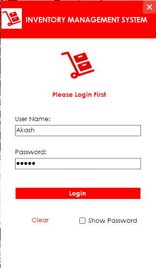
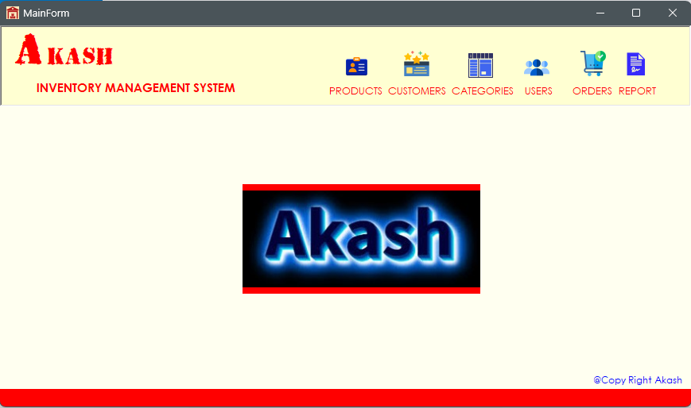
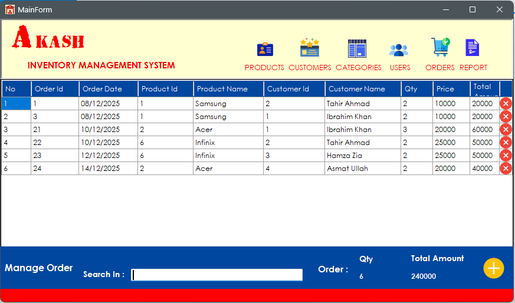
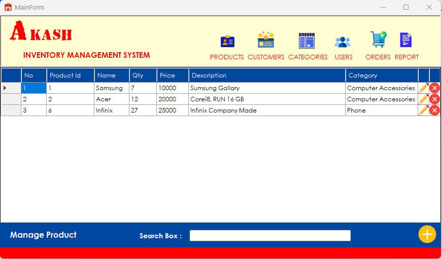
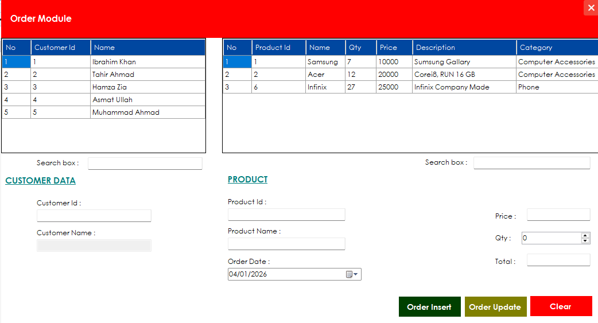
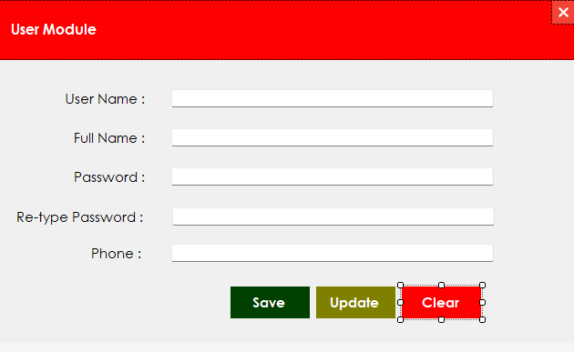
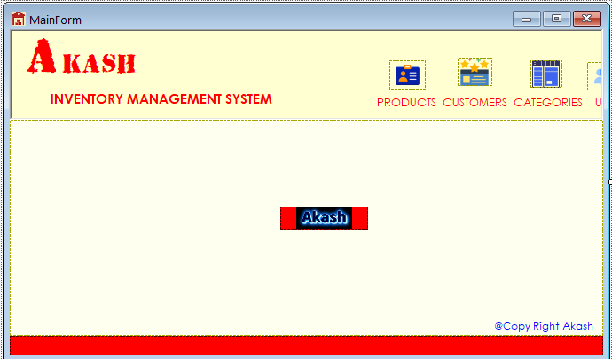
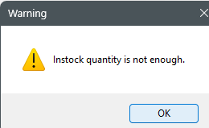

# 📦 Inventory Management System


---

## 📸 Application Screenshots

| Login Screen | Dashboard |
|--------------|-----------|
|  |  |

| Products Management | Inventory Tracking |
|---------------------|-------------------|
|  |  |

| Add/Edit Product | Stock Management |
|------------------|------------------|
|  |  |

| Reports (Crystal Reports) | Additional Features |
|---------------------------|---------------------|
|  |  |

---

## 🎯 Project Overview

This is a simple and functional **Inventory Management System** developed using:

- ✅ **Visual Studio 2019**
- ✅ **.NET Framework (Windows Forms)**
- ✅ **Microsoft SQL Server Express LocalDB (Version 13.0.7037)**

---

## 🛠️ Technologies Used

| Technology | Description |
|------------|-------------|
| **C#** | .NET Framework – Windows Forms |
| **SQL Server 2019** | LocalDB (Express) |
| **Crystal Reports** | Reporting and document generation |

---

## 🗄️ Database Information

| Property | Value |
|----------|-------|
| **Database File** | `dbIMS.mdf` |
| **Location** | Project folder (linked using `\|DataDirectory\|` for portability) |

### Connection String Example:

```csharp
SqlConnection con = new SqlConnection(@"Data Source=(LocalDB)\MSSQLLocalDB;AttachDbFilename=|DataDirectory|\dbIMS.mdf;Integrated Security=True");
```

---

## 🔐 Login Credentials

The application supports **3 predefined users**:

| Username | Password |
|----------|----------|
| **Akash** | 12345 |
| **Tahir** | 1234 |
| **Ahmad** | 123 |

> ⚠️ Enter these credentials on the login form to access the system.

---

## ✨ Features

- ✅ **User Authentication** - Secure login with predefined users
- ✅ **Product Management** - Add, edit, and delete products
- ✅ **Inventory Tracking** - Monitor stock levels in real-time
- ✅ **Stock Management** - Update inventory quantities
- ✅ **Crystal Reports** - Generate professional reports
- ✅ **Database Integration** - SQL Server LocalDB for data persistence

---

## 🚀 How to Run the Project

### Prerequisites

| Software | Version |
|----------|---------|
| Visual Studio | 2019 or later |
| SQL Server | Express LocalDB |
| Crystal Reports | Runtime (for reports feature) |

### Installation Steps

1. **Clone the repository**
```bash
git clone https://github.com/TahirAhmad88/InventoryManagementSystem.git
```

2. **Open the solution**
   - Open `InventoryManagementSystem.sln` in Visual Studio 2019

3. **Ensure LocalDB is running**
   - SQL Server Express LocalDB should be installed and active

4. **Build the solution**
   - Press `Ctrl + Shift + B` or click Build → Build Solution

5. **Run the application**
   - Press `F5` or click Debug → Start Debugging

---

## 📁 Project Structure

```
InventoryManagementSystem/
│
├── dbIMS.mdf                 (Database file)
├── InventoryManagementSystem.sln (Solution file)
├── images/                   (Screenshots folder)
│   ├── IMS1.png
│   ├── IMS2.png
│   ├── IMS3.png
│   ├── IMS4.png
│   ├── IMS5.png
│   ├── IMS6.png
│   ├── IMS8.png
│   └── IMSLogin7.png
├── README.md                 (This file)
└── READme_IMS.txt            (Additional notes)
```

---

## 📸 Screenshots Reference

| Image File | Description |
|------------|-------------|
| `IMSLogin7.png` | Login Screen |
| `IMS1.png` | Main Dashboard |
| `IMS2.png` | Products Management |
| `IMS3.png` | Inventory Tracking |
| `IMS4.png` | Add/Edit Product |
| `IMS5.png` | Stock Management |
| `IMS6.png` | Crystal Reports |
| `IMS8.png` | Additional Features |

---

## 📫 Connect With Me

[](https://linkedin.com/in/tahirahmad)
[](https://github.com/TahirAhmad88)

---

## ⭐ Show Your Support

If you found this project helpful, please give it a star ⭐ on GitHub!
